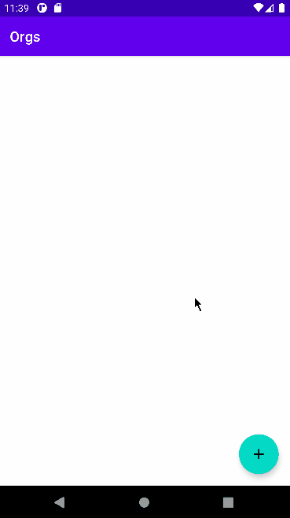

# 📋 Introdução ao Orgs 

App de simulação de um e-commerce para produtos naturais para o curso de fundamentos de Android com Kotlin.

## ✔️ Funcionalidades

Nesta versão o App possui as seguintes funcionalidades:
 
- Listagem de produtos
- Cadastro de produtos

## 🔨 Técnicas e tecnologias no projeto 

- Kotlin
- Activities
- Layout para Activities
    - ConstraintLayout
    - TextView
    - RecyclerView
    - EditText
    - Button
- Binding de View
- Listener de clique
- AndroidX
    - AppCompatActivity
- Refatoração de código

## 🎯 Desafio

Utilização do View Binding para realizar o processo de binding de Views. Você pode [conferir o resultado do desafio neste commit](https://github.com/alura-cursos/android-com-kotlin-fundamentos/commit/e515fca9480c610200f9f13d6ac3c504fd130e07).

## 📂 Acesso ao projeto

Você pode [baixar](https://github.com/alura-cursos/android-com-kotlin-fundamentos/archive/refs/heads/aula-8.zip) ou [acessar o código fonte](https://github.com/alura-cursos/android-com-kotlin-fundamentos/tree/aula-8) do projeto final.
